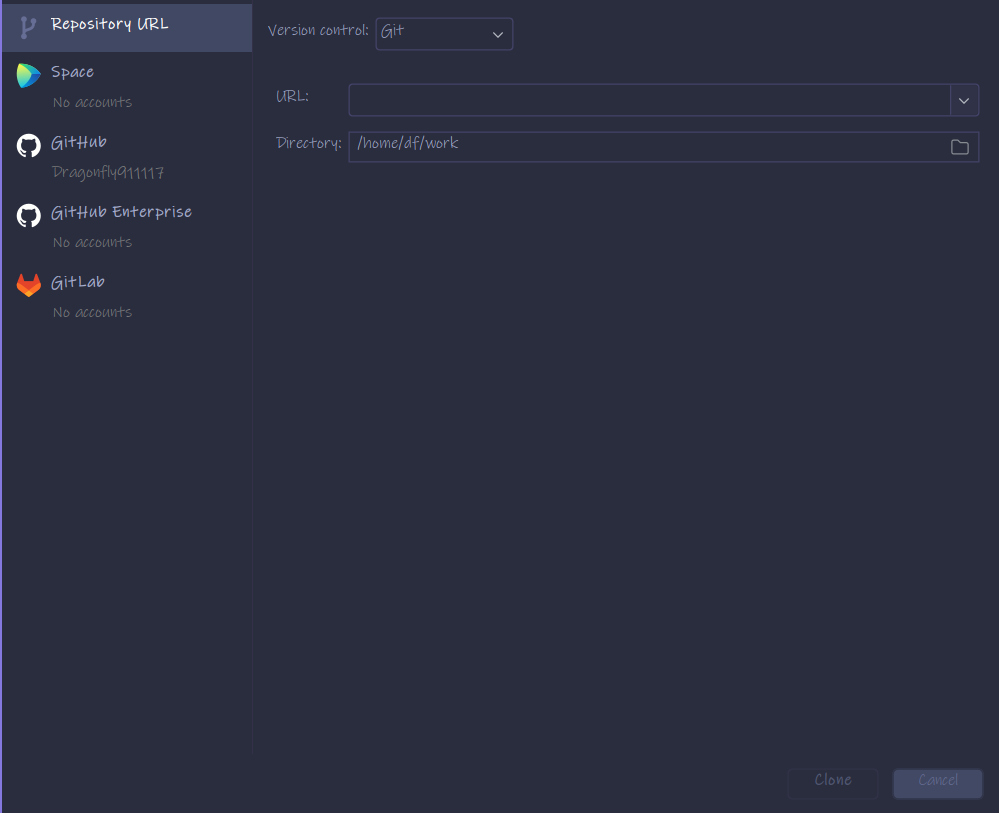
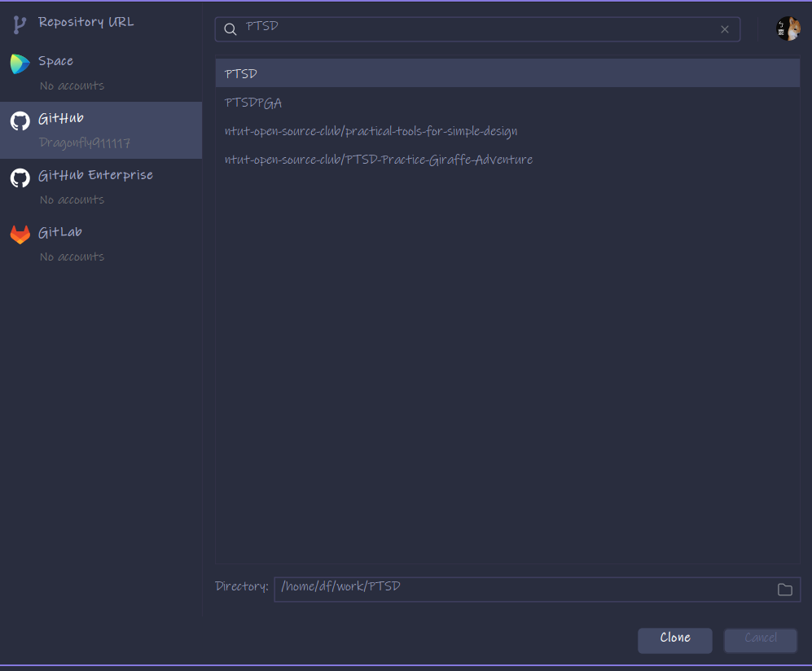
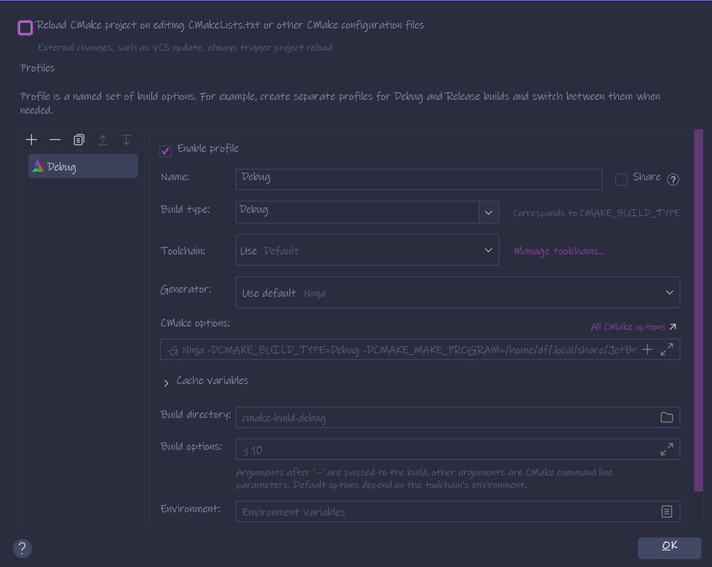

### CLion Quick Start

####   

The reader is encouraged to read
the [official guide](https://www.jetbrains.com/help/clion/clion-quick-start-guide.html#before-start).

#### Install CLion

* Read [this](https://hackmd.io/FNdnGXTgSyOsjZk0XSEIzA?both#%E4%BD%BF%E7%94%A8-JB-Toolbox-%E5%AE%89%E8%A3%9D) if you
  have trouble installing it or for some random knowledge.
  
#### Clone the project from remote

1. Press the `Get from VCS` button at the top-right of project menu. 
2. Clone the repo.
    * Paste the url of the repo and click `clone`.
    * Alternately, the user may log in their GitHub or GitLab account to list all their
      repos.
3. Post-clone configs
   
   A few adjustments are recommend:
    * On the top of the window, The user may want to
      enable `Reload CMake project on editing CMakeLists.txt or other Cmake configuration files` as it would be
      convenient not having to manually reload after adding/removing source files.
    * The user may want to add more cmake profiles(One may do so by pressing the `+` button or with hot
      key `Alt Insert`) for different toolchains or build type.
4. Build, run, and debug the project\
   After opening the project, CLion loads CMakeLists.txt(`cmake -B cmake-build-debug` or paths set).
    * : Build(`cmake --build $CMAKE_BUILD_PATH`, hot key:`Ctrl F9` by default)
    * : Build and Run(hot key: `Shift F10`)
    * : Build and Debug(hot key: `Shift F9)
